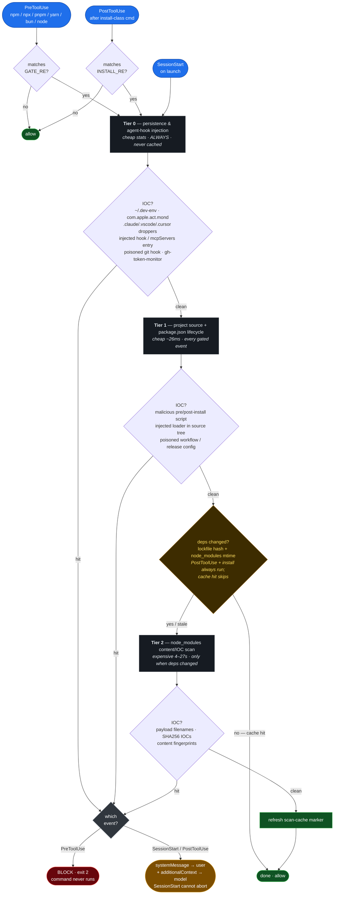

# wormhook

A Claude Code plugin that catches npm/node **supply-chain malware** at the hook —
before it can run. It binds to Claude Code's tool lifecycle and blocks `npm`/
`pnpm`/`yarn`/`bun`/`npx`/`node` commands when it finds a known indicator of
compromise. Named for the threat it headlines: Shai-Hulud, the self-replicating
npm *worm* — stopped at the hook.

**This is one lock, not the whole door.** It is not a replacement for an
install-layer firewall like [Socket Firewall (`sfw`)](https://socket.dev/) or a
dependency auditor like [`safedep/vet`](https://github.com/safedep/vet); it's an
*independent* layer that sits at the Claude Code agent boundary and trips on the
specific campaigns below. Defense-in-depth means several uncoordinated locks — run
this **alongside** an install firewall and lockfile pinning, not instead of them.
The value is independence: a worm that learns to slip one lock still has to beat the
others.

Built and maintained by [NoTambourine](https://notambourine.com).

## Install

```bash
claude plugin marketplace add notambourine/wormhook
claude plugin install wormhook@notambourine --scope user
```

Requires `jq` and `bash` on `PATH`. There is no command to invoke — once
installed, it runs automatically.

## How it works



The scan is **tiered by cost × volatility**, so the expensive part only runs when
it can actually find something new:

- **Tier 0 — persistence & agent/dev-env injection** (cheap stat checks, every event):
  RAT droppers (`com.apple.act.mond`), Shai-Hulud runner installs (`~/.dev-env`),
  agent-hijack droppers in `.claude/`/`.vscode/`, injected `hooks` **and rogue
  `mcpServers`** entries across Claude Code / Cursor / Continue / Windsurf configs,
  poisoned git hooks (direct, `init.templateDir`, or `core.hooksPath`), and
  `gh-token-monitor` launch units.
- **Tier 1 — project source, `package.json` lifecycle & CI config** (cheap, every
  gated event): scans install-lifecycle scripts and the project tree for injected
  loaders — plus `.github/workflows` and `.releaserc`/`.release-it.json` for
  workflow/release-config poisoning. This is the tier that fires *before* an install
  can execute a dropper, and it's the one that catches a malicious **pull request**
  into a repo you only partly trust.
- **Tier 2 — `node_modules` content/IOC scan** (expensive): runs only when
  dependencies actually changed, keyed off the lockfile hash + `node_modules`
  mtime (cached under `~/.cache/notambourine/`). The walk is bounded by a 20s
  `timeout`; on very large trees (~20k+ files — measured: a 22.7k-file pnpm tree
  lands right at the cap) it may scan only partially rather than hang the session.
  This is deliberate: Tier 2 **fails open** and is advisory at `SessionStart`, and
  the `PostToolUse` re-scan covers the freshly written tree after an install — so a
  truncated startup scan trades completeness for never blocking your launch. The
  install-time gate that actually *blocks* is Tier 1, which has no such ceiling.

It binds to three events:

| Event | When | What |
|-------|------|------|
| `PreToolUse` | before an `npm`/`node`/… command | Tier 0–1 (+ Tier 2 if deps drifted); **blocks** (exit 2) on a hit |
| `PostToolUse` | right after an install-class command | full re-scan of the freshly written tree; reports via `systemMessage` |
| `SessionStart` | on launch | Tier 0–1 (+ Tier 2 on a stale cache); reports via `systemMessage` + context |

**Enforcement reality (where the lock actually holds).** The only true hard block
Claude Code offers is `PreToolUse` exit 2 — that stops the `npm`/`node` command
outright, regardless of whether the model cooperates. `SessionStart` and
`PostToolUse` run *after* the point of no return, and Claude Code has no mechanism
to abort a session, so they can't "refuse to boot." Instead they deliver findings on
two channels: a `systemMessage` shown straight to **you**, and `additionalContext`
that instructs the model to refuse follow-up installs. That's deliberately stronger
than the old "drop a note in context and hope" approach — but startup-time findings
are a *warning to act on*, not a wall. The wall is the `PreToolUse` block (and the
install-layer firewall you run alongside it).

## What it detects

- **Shai-Hulud 1.0–3.0 and the Mini variant** — obfuscation markers, runner
  fingerprints, dead-man's-switch ransom tokens, `git-tanstack` typosquat exfil,
  known payload filenames, and SHA256 IOCs.
- **Axios / plain-crypto-js RAT** (Sapphire Sleet / DPRK) — `com.apple.act.mond`
  persistence and `sfrclak` C2 beacons.
- **SANDWORM_MODE** — AI-toolchain poisoning: the `SANDWORM_MODE` marker, the
  `pkg-metrics.*.workers.dev/{exfil,drain}` C2, the `freefan`/`fanfree` DNS-tunnel
  domains, and the hard-coded drain bearer token.
- **Dev-environment & CI injection** (Mini Shai-Hulud / SANDWORM_MODE) — rogue
  `mcpServers` / SessionStart-hook entries in agent + editor configs, poisoned git
  hooks (`init.templateDir` / `core.hooksPath`), `pull_request_target` workflows
  calling the `ci-quality/code-quality-check` action, and `@semantic-release/exec`
  carrier injection in `.releaserc`/`.release-it.json`.
- **Remote-eval loaders** — `atob(process.env.…)` + `eval`/`Function(await …)`
  behavioral fingerprints, where the C2 URL is hidden in an env var and the
  payload is fetched at runtime (no in-tree payload signature to match).

### Threat model: the repo you *pseudo-trust*

This lock is organized around one path in particular: a contributor — or a
compromised maintainer's PR — slipping malware into a repo you already work in,
rather than you knowingly installing a sketchy package. It doesn't claim to cover
every vector (that's what the other locks are for); it aims to be the layer that
notices *this* one. The vectors it watches and where each is caught:

| Injection vector in a shared repo | Caught by |
|-----------------------------------|-----------|
| Dependency with a poisoned `preinstall` | Tier 1 lifecycle gate → **blocks** the install |
| Loader hidden in a source file (e.g. `routes/auth.js`) | Tier 1 project-source scan |
| Malicious file already in `node_modules` | Tier 2 filename + SHA256 + content IOC |
| PR adding a `pull_request_target` workflow that exfiltrates secrets | Tier 1 workflow scan |
| PR editing `.releaserc` to `require()` a carrier on publish | Tier 1 release-config scan |
| Rogue `mcpServers` / SessionStart hook committed to `.claude`, `.cursor`, … | Tier 0 agent-config scan |
| `init.templateDir`/`core.hooksPath` pointing at a poisoned git hook | Tier 0 git-hook scan |

`pull_request_target` and `@semantic-release/exec` are *legitimately common*, so
those scans key off the campaign-specific fingerprints (the known-bad action slug,
the carrier `require()`), not the generic feature — keeping CI false positives at
zero.

## Signatures

All signatures live in one file — [`scripts/malware-patterns.sh`](./scripts/malware-patterns.sh) —
sourced by the hook so a new pattern reaches every tier at once. This is the
canonical home for the patterns; add a campaign here and every scan surface picks
it up. Patterns are extended regex (`grep -E`) and parse identically under bash
and zsh, so the same file can back a shell `git`-merge gate as well as the hook.

## Sources

Signatures are derived from primary vendor and government advisories, not
second-hand summaries. Each campaign's IOCs trace to one of these:

- **CISA** — [Widespread supply-chain compromise impacting the npm ecosystem](https://www.cisa.gov/news-events/alerts/2025/09/23/widespread-supply-chain-compromise-impacting-npm-ecosystem) (Shai-Hulud 1.0, Sep 2025)
- **Microsoft Security** — [Shai-Hulud 2.0: guidance for detecting, investigating and defending against the supply-chain attack](https://www.microsoft.com/en-us/security/blog/2025/12/09/shai-hulud-2-0-guidance-for-detecting-investigating-and-defending-against-the-supply-chain-attack/) (`setup_bun.js`, `bun_environment.js`, `FilePII_*`, TruffleHog, GitHub exfil)
- **Datadog Security Labs** — [Shai-Hulud 2.0 npm worm](https://securitylabs.datadoghq.com/articles/shai-hulud-2.0-npm-worm/) (self-replication mechanics, `Sha1-Hulud: The Second Coming` repos, SHA256 hashes)
- **Wiz** — [Mini Shai-Hulud strikes again: TanStack & more npm packages compromised](https://www.wiz.io/blog/mini-shai-hulud-strikes-again-tanstack-more-npm-packages-compromised) (`router_init.js`, `.claude`/`.vscode` persistence, `git-tanstack.com` + Session-network exfil, `gh-token-monitor`)
- **Semgrep** — [Axios supply-chain incident: IOCs and how to contain the threat](https://semgrep.dev/blog/2026/axios-supply-chain-incident-indicators-of-compromise-and-how-to-contain-the-threat/) (Sapphire Sleet / DPRK RAT, `com.apple.act.mond`, `sfrclak.com` C2)
- **Socket** — [SANDWORM_MODE npm worm: AI-toolchain poisoning](https://socket.dev/blog/sandworm-mode-npm-worm-ai-toolchain-poisoning) (MCP/agent-config injection, git-hook & `pull_request_target` persistence, `@semantic-release/exec` carrier, `*.workers.dev` drain endpoints, DNS tunneling)

The same list, with the specific marker each advisory contributed, is mirrored in
the header of [`scripts/wormhook.sh`](./scripts/wormhook.sh) so the provenance sits
next to the code that uses it.

## License

MIT. See [LICENSE](./LICENSE).
