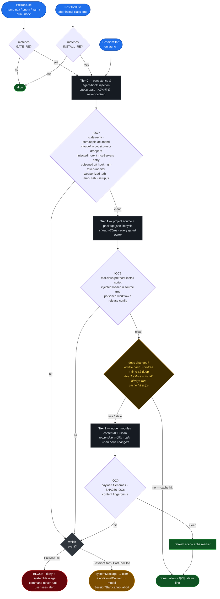

# wormhook

A Claude Code plugin that catches npm/node **supply-chain malware** at the hook —
before it can run. It binds to Claude Code's tool lifecycle and blocks `npm`/
`pnpm`/`yarn`/`bun`/`npx`/`node` commands when it finds a known indicator of
compromise. Named for the threat it headlines: Shai-Hulud, the self-replicating
npm *worm* — stopped at the hook.

**This is one lock, not the whole door.** It is not a replacement for an
install-layer firewall like [Socket Firewall (`sfw`)](https://socket.dev/) or a
dependency auditor like [`safedep/vet`](https://github.com/safedep/vet); it's an
*independent* layer that sits at the Claude Code agent boundary and trips on the
specific campaigns below. Defense-in-depth means several uncoordinated locks — run
this **alongside** an install firewall and lockfile pinning, not instead of them.
The value is independence: a worm that learns to slip one lock still has to beat the
others.

Built and maintained by [NoTambourine](https://notambourine.com).

## Install

```bash
claude plugin marketplace add notambourine/wormhook
claude plugin install wormhook@notambourine --scope user
```

Requires `jq` and `bash` on `PATH`. [`ripgrep`](https://github.com/BurntSushi/ripgrep)
is optional but strongly recommended — content scans use it when present (43x
faster than BSD grep on large trees, measured) and fall back to `grep` otherwise.
There is no command to invoke — once installed, it runs automatically. A
silent-by-default doctor hook (`scripts/doctor.sh`) speaks up at `SessionStart`
only if a dependency is missing: 🟡 with the `brew install` one-liner to fix it.

## How it works



The scan is **tiered by cost × volatility**, so the expensive part only runs when
it can actually find something new:

- **Tier 0 — persistence & agent/dev-env injection** (cheap stat checks, every event):
  RAT droppers (`com.apple.act.mond`), Shai-Hulud runner installs (`~/.dev-env`),
  agent-hijack droppers in `.claude/`/`.vscode/`, injected `hooks` **and rogue
  `mcpServers`** entries across Claude Code / Cursor / Continue / Windsurf configs,
  poisoned git hooks (direct, `init.templateDir`, or `core.hooksPath`), and
  `gh-token-monitor` launch units.
- **Tier 1 — project source, `package.json` lifecycle & CI config** (cheap, every
  gated event): scans install-lifecycle scripts and the project tree for injected
  loaders — plus `.github/workflows` and `.releaserc`/`.release-it.json` for
  workflow/release-config poisoning. This is the tier that fires *before* an install
  can execute a dropper, and it's the one that catches a malicious **pull request**
  into a repo you only partly trust.
- **Tier 2 — `node_modules` content/IOC scan** (expensive): runs only when
  dependencies actually changed, keyed off the lockfile hash + the max mtime of
  `node_modules` dirs ≤2 levels deep (cached under `~/.cache/notambourine/`) —
  depth-2 dir mtimes catch a payload hand-planted up to 3 levels in (package
  roots, `@scope/pkg` roots), which a root-only mtime missed between installs.
  Content scans run on **ripgrep when available**, falling back to `grep`
  (measured on a 58k-file `node_modules`: BSD grep 30.3s, rg 0.7s — the full
  three-tier scan completes in ~1.2s). Each signature pattern is compile-gated
  against rg at runtime; one that only parses as POSIX ERE falls back to grep for
  that scan rather than mis-parse. The walk is bounded by a 20s `timeout`; on a
  very large tree under the grep fallback it may scan only partially rather than
  hang the session.
  This is deliberate: Tier 2 **fails open** and is advisory at `SessionStart`, and
  the `PostToolUse` re-scan covers the freshly written tree after an install — so a
  truncated startup scan trades completeness for never blocking your launch. A
  truncated scan is reported as 🟡 (not 🟢) and does **not** refresh the clean-scan
  cache, so the next gated event retries the full walk. The install-time gate that
  actually *blocks* is Tier 1, which has no such ceiling — its source scan runs to
  completion, because a truncated walk at the blocking tier is a coverage hole, not
  a degradation. (The harness still bounds the whole hook via the `timeout` in
  `hooks.json`, set to 300s so only a genuinely pathological tree hits it.)

It binds to three events:

| Event | When | What |
|-------|------|------|
| `PreToolUse` | before an `npm`/`node`/… command | Tier 0–1 (+ Tier 2 if deps drifted); **blocks** (`permissionDecision: "deny"` + user-facing `systemMessage`) on a hit; 🟢/🟡 status line on a pass |
| `PostToolUse` | right after an install-class command | full re-scan of the freshly written tree; reports via `systemMessage`; 🟢/🟡 status line on a pass |
| `SessionStart` | on launch | Tier 0–1 (+ Tier 2 on a stale cache); reports via `systemMessage` + context; 🟢/🟡 status line on a pass |

**Enforcement reality (where the lock actually holds).** The hard block is at
`PreToolUse`, emitted as `permissionDecision: "deny"` — that stops the `npm`/`node`
command outright, regardless of whether the model cooperates. It rides three channels
in one response: `deny` (blocks the command), a `systemMessage` that shows the 🚨 alert
straight to **you** at block time, and a `permissionDecisionReason` that tells the model
to state the block plainly and not work around it. (Exit code 2 is an equally valid hard
block, but it routes its alert to stderr — which Claude Code shows to the *model* only,
so you'd see the alert solely if the model relayed it. `deny` + `systemMessage` hits all
three audiences at once.) `SessionStart` and `PostToolUse` run *after* the point of no
return, and Claude Code has no mechanism to abort a session, so they can't "refuse to
boot." Instead they deliver findings on two channels: a `systemMessage` shown straight to
**you**, and `additionalContext` that instructs the model to refuse follow-up installs.
Startup-time findings are a *warning to act on*, not a wall. The wall is the `PreToolUse`
block (and the install-layer firewall you run alongside it).

**Always-on status line.** Every scan that runs ends with a one-line verdict via
`systemMessage`, so silence is never ambiguous — "scanned clean" and "hook never
ran" used to look identical (the same invisibility class as the stderr bug above):

- 🟢 `[wormhook] clean (persistence + source + node_modules)` — all scheduled tiers
  ran and found nothing. The scope names what actually ran: `(cached, deps
  unchanged)` means Tier 2 was skipped on a cache hit, not silently dropped.
- 🟡 `[wormhook] passed with caveats (…) — …` — no IOCs found, but coverage was
  degraded: a grep/find walk hit its `timeout` ceiling, or the bundled signature
  file is missing. A 🟡 run never refreshes the clean-scan cache.
- 🚨 — findings, delivered on the alert channels described above.

The 🟢/🟡 traffic-light glyphs (with the `[wormhook]` tag) are deliberate: they
match the common convention for SessionStart status hooks, so wormhook's line
reads as part of one uniform dashboard strip alongside any other lights you run.

Non-gated commands (anything that isn't `npm`/`node`/`npx`/`pnpm`/`yarn`/`bun`)
stay silent: no scan ran, so there is no verdict to report.

## What it detects

- **Shai-Hulud 1.0–3.0 and the Mini variant** — obfuscation markers, runner
  fingerprints, dead-man's-switch ransom tokens, `git-tanstack` typosquat exfil,
  known payload filenames, and SHA256 IOCs.
- **Axios / plain-crypto-js RAT** (Sapphire Sleet / DPRK) — `com.apple.act.mond`
  persistence and `sfrclak` C2 beacons.
- **SANDWORM_MODE** — AI-toolchain poisoning: the `SANDWORM_MODE` marker, the
  `pkg-metrics.*.workers.dev/{exfil,drain}` C2, the `freefan`/`fanfree` DNS-tunnel
  domains, and the hard-coded drain bearer token.
- **Hades / Miasma PyPI wave** (Mini Shai-Hulud, Jun 2026) — the cross-ecosystem
  campaign that typosquats MCP packages (`openai-mcp`, `langchain-core-mcp`,
  `tiktoken-mcp`, …) to ship a **weaponized Python `.pth` startup hook**: Python
  auto-executes its `import`-prefixed line on every interpreter start, downloading
  Bun and running a bundled `_index.js` JS stealer (Hades). Caught at Tier 0 as a
  persistence artifact — the `.pth` (by known name/SHA256 or its behavioral tell: a
  `.pth` that spawns a process / opens a socket / fetches a URL, none of which a
  legit sys.path `.pth` does), the `/tmp/.sshu-setup.js` SSH-propagation dropper,
  and the `thebeautiful{march,snads}oftime` fallback C2-discovery strings in the JS
  payload. *(`pip`/`uv` are not gated — see [what it deliberately doesn't do](#what-it-deliberately-doesnt-do) — so this is detected as a landed persistence artifact on the next event, not blocked pre-install.)*
- **Dev-environment & CI injection** (Mini Shai-Hulud / SANDWORM_MODE) — rogue
  `mcpServers` / SessionStart-hook entries in agent + editor configs, poisoned git
  hooks (`init.templateDir` / `core.hooksPath`), `pull_request_target` workflows
  calling the `ci-quality/code-quality-check` action, and `@semantic-release/exec`
  carrier injection in `.releaserc`/`.release-it.json`.
- **Remote-eval loaders** — `atob(process.env.…)` + `eval`/`Function(await …)`
  behavioral fingerprints, where the C2 URL is hidden in an env var and the
  payload is fetched at runtime (no in-tree payload signature to match) — plus the
  field-observed C2/exfil hosts these campaigns embed in-source (`m-kosche.com`,
  `auth-confirm-nine.vercel.app`, `api.masscan.cloud`, `*.getsession.org` exfil
  nodes), mirrored from the network-blocklist companion lock.
- **Campaign-agnostic behaviors** (the `node_modules` tier only) — generic
  malicious *behaviors* that catch the next campaign before it has a name:
  decode-then-`eval` droppers (`eval`/`Function(atob(…` / `Function(Buffer.from(…`),
  bash reverse shells (`/dev/tcp/`), and bulk environment exfil
  (`JSON.stringify(process.env)`) or git-credential-store reads. These are a
  higher-FP class than the IOCs above, so they're scoped to third-party deps —
  see [what it deliberately doesn't do](#what-it-deliberately-doesnt-do) for the
  patterns held back (IMDS, interactive-shell spawn) and why.

### Threat model: the repo you *pseudo-trust*

This lock is organized around one path in particular: a contributor — or a
compromised maintainer's PR — slipping malware into a repo you already work in,
rather than you knowingly installing a sketchy package. It doesn't claim to cover
every vector (that's what the other locks are for); it aims to be the layer that
notices *this* one. The vectors it watches and where each is caught:

| Injection vector in a shared repo | Caught by |
|-----------------------------------|-----------|
| Dependency with a poisoned `preinstall` | Tier 1 lifecycle gate → **blocks** the install |
| Loader hidden in a source file (e.g. `routes/auth.js`) | Tier 1 project-source scan |
| Malicious file already in `node_modules` | Tier 2 filename + SHA256 + content IOC |
| PR adding a `pull_request_target` workflow that exfiltrates secrets | Tier 1 workflow scan |
| PR editing `.releaserc` to `require()` a carrier on publish | Tier 1 release-config scan |
| Rogue `mcpServers` / SessionStart hook committed to `.claude`, `.cursor`, … | Tier 0 agent-config scan |
| `init.templateDir`/`core.hooksPath` pointing at a poisoned git hook | Tier 0 git-hook scan |
| Weaponized Python `.pth` in a project venv's `site-packages` (Hades/Miasma) | Tier 0 `.pth` startup-hook scan |

`pull_request_target` and `@semantic-release/exec` are *legitimately common*, so
those scans key off the campaign-specific fingerprints (the known-bad action slug,
the carrier `require()`), not the generic feature — keeping CI false positives at
zero.

**Can the worm just disable the scanner?** This is wormhook's own threat model
turned on itself: a campaign whose whole MO is writing into `~/.claude/` (Mini
Shai-Hulud's AGENT-HIJACK) could, in principle, edit the scanner sitting next to
the hook it injects. [sloppy-joe](https://github.com/brennhill/sloppy-joe) answers
this by keeping its config *outside* the project repo so an agent with shell access
can't weaken its own checks. wormhook gets most of that property for free: the
signatures ship in the **installed plugin directory**, not the project tree, so a
project-scoped agent never has them in reach. The residual gap is a worm with write
access to `$HOME` editing the plugin itself — out of scope for a single hook to
defend against (the OS/file-permission layer owns it), but worth naming: if you sync
`~/.claude/` across machines, treat the plugin dir as security-sensitive and review
diffs to it the same way you would an injected hook.

## What it deliberately doesn't do

wormhook is one lock, and a narrow one on purpose. Several common supply-chain
checks are *deliberately* out of scope because they need context a synchronous,
no-network hook doesn't have — pushing them in would trade away the near-zero
false-positive rate that makes the block trustworthy. Each is owned by a different
layer you should run alongside:

| Check it doesn't do | Why not (at the hook) | Layer that owns it |
|---------------------|------------------------|--------------------|
| Package existence / hallucination, typosquatting, version-age & download gating, maintainer-change | All need live **registry** lookups; the hook runs with no network | [`safedep/vet`](https://github.com/safedep/vet), [Socket](https://socket.dev/), [sloppy-joe](https://github.com/brennhill/sloppy-joe) |
| Known-CVE vulnerability scanning | Needs an OSV/advisory feed | `vet`, `npm audit`, Dependabot |
| Secret detection (entropy / format regex) | A scanner's job, not a malware gate | `gitleaks`, `trufflehog` |
| Generic GitHub Actions hardening (unpinned actions, broad permissions, all `pull_request_target`) | Flagging the generic feature blows up CI false positives — wormhook keys off campaign fingerprints only | `actionlint`, `zizmor`, depsec |
| Runtime network monitoring (live C2, DNS exfil, reverse-shell sockets) | A static hook can't watch live sockets; it matches the *code*, not the connection | an install-time sandbox / eBPF runtime monitor |
| AST + reachability analysis to vet `eval`/`exec` | wormhook keeps grep patterns deliberately narrow instead of parsing — no AST means it can't safely scan broadly, so it doesn't try | [depsec](https://depsec.dev/) (tree-sitter) |
| Flagging any `child_process` exec/spawn (guarddog `npm-silent-process-execution`) | Half the registry shells out legitimately — block-tier FP catastrophe; it's a *triage* signal, not a *block* signal | [GuardDog](https://github.com/DataDog/guarddog) (WARNING-tier, human triage) |
| Obfuscated dynamic API calls — `Reflect.get`, bracket-access (guarddog `npm-api-obfuscation`) | Legit metaprogramming, polyfills, and bundlers use these; WARNING-tier triage | GuardDog |
| Credential-file reads → network exfil (`.aws/credentials`, `/etc/passwd`, `.ssh/id_rsa`; guarddog `npm-exfiltrate-sensitive-data`) | Needs **taint tracking** (the credential must *flow into* the request) — co-occurrence alone FPs on `aws-sdk`, k8s, and ssh libs that legitimately read these *and* make HTTPS calls | GuardDog (`mode: taint`) |
| Raw-IP / crypto-RPC / APT C2 blocklisting (`api.trongrid.io`, bare IPs) | Matching a raw IP or a legit blockchain RPC in dep *source* is high-FP, low-signal — a connection-time control, not a content one | a DNS/pf network blocklist (e.g. `/etc/hosts` + `pf` table) |
| **Pre-install gating of `pip`/`uv`/PyPI** (block a malicious `pip install` the way `npm install` is blocked) | The `PreToolUse` hard block is scoped to the npm/node command set; gating Python would need pre-install wheel inspection a no-network hook can't cheaply do. The Hades/PyPI vector is instead caught as a **landed persistence artifact** (the weaponized `.pth`) at Tier 0 on the next event — the same model Tier 0 uses for `~/.dev-env` and `com.apple.act.mond` | an install-time sandbox / [`safedep/vet`](https://github.com/safedep/vet) (PyPI) / [GuardDog](https://github.com/DataDog/guarddog) |

The design bet is **independence over coverage**: a fast, no-network, near-zero-FP
gate at the agent boundary that trips on a specific, evidence-backed set of
indicators — run *alongside* the layers above, not instead of them. Two of the rows
above (`serialize-environment`, decode-then-`eval`) *were* portable and have been
adopted as [campaign-agnostic behaviors](#what-it-detects); the rest stay out on
purpose, and the line between them is FP-safety, not effort.

## Signatures

All signatures live in one file — [`scripts/malware-patterns.sh`](./scripts/malware-patterns.sh) —
sourced by the hook so a new pattern reaches every tier at once. This is the
canonical home for the patterns; add a campaign here and every scan surface picks
it up. Patterns are extended regex (`grep -E`) and parse identically under bash
and zsh, so the same file can back a shell `git`-merge gate as well as the hook.

## Sources

Signatures are derived from primary vendor and government advisories, not
second-hand summaries. Each campaign's IOCs trace to one of these:

- **CISA** — [Widespread supply-chain compromise impacting the npm ecosystem](https://www.cisa.gov/news-events/alerts/2025/09/23/widespread-supply-chain-compromise-impacting-npm-ecosystem) (Shai-Hulud 1.0, Sep 2025)
- **Microsoft Security** — [Shai-Hulud 2.0: guidance for detecting, investigating and defending against the supply-chain attack](https://www.microsoft.com/en-us/security/blog/2025/12/09/shai-hulud-2-0-guidance-for-detecting-investigating-and-defending-against-the-supply-chain-attack/) (`setup_bun.js`, `bun_environment.js`, `FilePII_*`, TruffleHog, GitHub exfil)
- **Datadog Security Labs** — [Shai-Hulud 2.0 npm worm](https://securitylabs.datadoghq.com/articles/shai-hulud-2.0-npm-worm/) (self-replication mechanics, `Sha1-Hulud: The Second Coming` repos, SHA256 hashes)
- **Wiz** — [Mini Shai-Hulud strikes again: TanStack & more npm packages compromised](https://www.wiz.io/blog/mini-shai-hulud-strikes-again-tanstack-more-npm-packages-compromised) (`router_init.js`, `.claude`/`.vscode` persistence, `git-tanstack.com` + Session-network exfil, `gh-token-monitor`)
- **Semgrep** — [Axios supply-chain incident: IOCs and how to contain the threat](https://semgrep.dev/blog/2026/axios-supply-chain-incident-indicators-of-compromise-and-how-to-contain-the-threat/) (Sapphire Sleet / DPRK RAT, `com.apple.act.mond`, `sfrclak.com` C2)
- **Socket** — [SANDWORM_MODE npm worm: AI-toolchain poisoning](https://socket.dev/blog/sandworm-mode-npm-worm-ai-toolchain-poisoning) (MCP/agent-config injection, git-hook & `pull_request_target` persistence, `@semantic-release/exec` carrier, `*.workers.dev` drain endpoints, DNS tunneling)
- **Socket** — [Mini Shai-Hulud, Miasma & Hades worms target bioinformatics and MCP developers](https://socket.dev/blog/mini-shai-hulud-miasma-and-hades-worms-target-bioinformatics-and-mcp-developers-via-malicious) (PyPI MCP typosquats, weaponized `*.pth` startup hook → Bun → `_index.js` Hades stealer, `langchain_core-setup.pth` SHA256, `/tmp/.sshu-setup.js` SSH propagation, `thebeautiful{march,snads}oftime` C2-discovery strings)

The same list, with the specific marker each advisory contributed, is mirrored in
the header of [`scripts/wormhook.sh`](./scripts/wormhook.sh) so the provenance sits
next to the code that uses it.

## License

MIT. See [LICENSE](./LICENSE).
