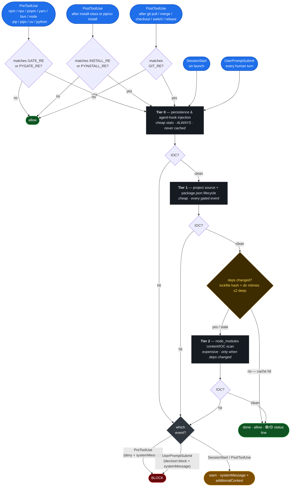

# wormhook

A Claude Code plugin that catches npm/node **supply-chain malware** at the hook —
before it can run. It binds to Claude Code's tool lifecycle and blocks `npm`/`pnpm`/
`yarn`/`bun`/`npx`/`node` commands when it finds a known indicator of compromise.
Named for the threat it headlines: Shai-Hulud, the self-replicating npm *worm* —
stopped at the hook.

**This is one lock, not the whole door.** It's not a replacement for an install-layer
firewall ([Socket Firewall](https://socket.dev/)) or a dependency auditor
([`safedep/vet`](https://github.com/safedep/vet)) — it's an *independent* layer at the
Claude Code agent boundary. Run it **alongside** those, not instead of them; the value
is independence — a worm that slips one lock still has to beat the others.

**Why this and not just pnpm/Socket?** The install layer is now well-served: pnpm 11 ships
a release-age [cooldown by default](https://pnpm.io/supply-chain-security) and Socket Firewall
blocks malicious versions as you install. wormhook deliberately cedes that boundary. Its
distinct, currently-unoccupied job is *blocking* — not warn-only — on **agent-boundary
persistence / AGENT-HIJACK**: rogue `SessionStart` hooks and `mcpServers` entries injected
into `.claude`/`.cursor`/`.continue`/`.vscode` configs, `.vscode/tasks.json` `folderOpen`
auto-exec, weaponized Python `.pth` startup hooks, poisoned git hooks, and login-persistent
LaunchAgent/systemd units. That is the half of the supply-chain kill-chain the registry-layer
tools do not see — and the half that re-runs every time you open the project.

Built and maintained by [NoTambourine](https://notambourine.com).

## Install

```bash
claude plugin marketplace add notambourine/wormhook
claude plugin install wormhook@notambourine --scope user
```

Requires `jq` and `bash`. [`ripgrep`](https://github.com/BurntSushi/ripgrep) is
optional but strongly recommended — content scans use it when present (43× faster than
BSD grep on large trees) and fall back to `grep` otherwise. There's nothing to invoke;
it runs automatically. At `SessionStart` a row of doctor status lights (🟢/🟡/🔴/⚪, one per
check, every session) reports your runtime deps, version drift, out-of-band coverage, the
recommended [companion firewalls](#beyond-the-tiers) (Socket Firewall / `vet`), and a
blast-radius exposure audit — each non-green light carries the one-liner to fix it.

## Run it outside Claude

The Claude hook only fires inside a Claude Code session. `wormhook-scan` runs the **same
engine** (Tiers 0–2, same `malware-patterns.sh`) from any shell — for the moments Claude
is not watching: a `git pull` in a plain terminal, coming back to the machine after a
while, or a morning fleet check. It is a thin adapter: no detection logic is duplicated,
so every signature update reaches it for free.

The fastest way to set it all up is from inside Claude Code: **`/wormhook-setup`** runs an
interactive installer (it asks which pieces you want and wires them) — the `SessionStart`
doctor points you to it. Or do it by hand:

```bash
# link wormhook-scan onto your PATH (~/.local/bin)
bash "$(claude plugin root wormhook 2>/dev/null || echo .)/scripts/wormhook-scan.sh" install-cli

wormhook-scan ~/code/*/            # scan every git repo under ~/code (node_modules pruned)
wormhook-scan                      # no args -> roots from your config (see below)
wormhook-scan --deep ~/code/myapp  # force the Tier-2 node_modules walk
wormhook-scan --persistence        # only the machine-wide ($HOME) persistence checks
```

Each path resolves to the **git repo(s)** at or under it (an org dir of repos expands to
its repos; `node_modules` is pruned), so you point at parents, not individual repos. A
machine-wide persistence finding (a poisoned `~/.claude`, a rogue LaunchAgent) is reported
**once** at the top, not repeated per repo. Exit code: `0` clean · `1` critical (or machine
persistence) · `2` degraded — so it gates a script or CI step.

**Config (team-shareable, per-machine roots).** With no path args, `wormhook-scan` reads
newline-delimited paths/globs from `${XDG_CONFIG_HOME:-~/.config}/wormhook/scan-roots`
(or `$WORMHOOK_SCAN_ROOTS`). `wormhook-scan config --init` seeds a commented sample to edit.

**Two automatic triggers (opt-in, both local, zero tokens):**

```bash
wormhook-scan install-launchd            # hourly background sweep (macOS launchd)
                                         #   notifies + logs; --every SECONDS to retune
wormhook-scan install-git-hook           # post-merge/checkout/rewrite audit on EVERY
                                         #   `git pull` in ANY terminal (not just Claude)
```

`install-launchd` is the right answer to "scan the machine while I am away" — a native
LaunchAgent runs `wormhook-scan` on a timer with **no Claude session and no LLM tokens**
(a cloud-scheduled agent could not see your local filesystem anyway). `install-git-hook`
cooperates with an existing `core.hooksPath` and never clobbers a hook you already have: on
every `git pull`/`checkout` it prints a one-line green **`🟢 … clean after git update`**
confirmation, or a **loud report of what the update changed plus any IOC** on a finding, so you
see it before you run `npm run dev`. (`wormhook-scan status` shows what is
installed; `uninstall-launchd` / `uninstall-git-hook` reverse cleanly. On Linux,
`install-launchd` prints a systemd-timer / cron line instead.)

**Optional exec-guard — block, don't just warn.** The git hook *warns*; a post-merge hook
cannot stop files that already landed. To actually refuse to *run* on a compromised repo
outside Claude — the out-of-session analog of the `PreToolUse` block — opt into a shell guard:

```bash
eval "$(wormhook-scan shell-init)"   # in ~/.zshrc/.bashrc, AFTER any nvm/asdf
```

It wraps `npm`/`pnpm`/`yarn`/`bun`/`npx` (not `node`) so they fast-scan the current repo and
**refuse** if it trips the engine — catching even IOCs that arrived without a git pull (a
fresh clone, a poisoned transitive dep). It is a tripwire, not a sandbox (`command npm` or a
direct `./node_modules/.bin/…` bypasses it) and fails open if `wormhook-scan` is absent.

**Already using Socket Firewall?** Don't keep a separate `npm() { sfw npm … }` block — it and the
guard define the same names, so whichever loads last silently clobbers the other. Chain them in one
wrapper (guard → `sfw` → real, each layer fail-open); `/wormhook-setup` prints the exact block:

```bash
eval "$(wormhook-scan shell-init)"   # defines _wormhook_guard
_sc_run() {
  local pm="$1"; shift
  command -v _wormhook_guard >/dev/null 2>&1 && { _wormhook_guard || return 1; }
  if command -v sfw >/dev/null 2>&1; then command sfw "$pm" "$@"; else command "$pm" "$@"; fi
}
for pm in npm pnpm yarn bun npx; do eval "${pm}() { _sc_run ${pm} \"\$@\"; }"; done; unset pm
```

### Gate pull requests on GitHub (Action)

wormhook ships an `action.yml`, so the **same engine** runs as a CI check. Drop it into any
repo's workflow to scan the checked-out tree on every PR:

```yaml
# .github/workflows/supply-chain.yml
name: supply-chain
on: pull_request
permissions:
  contents: read
jobs:
  wormhook:
    runs-on: ubuntu-latest
    steps:
      - uses: actions/checkout@v5
      - run: npm ci                       # optional — installs deps so the deep scan sees them
      - uses: notambourine/wormhook@v0.13.0
        # with:
        #   path: .            # dir to scan (default: workspace root)
        #   mode: deep         # deep = Tier-2 node_modules walk (default); fast = source-only
        #   fail-on: critical  # critical (default) | degraded (fail-closed on 🟡 too)
```

A 🚨 verdict fails the job (exit `1`); the finding banner prints above the error annotation. A
🟡 degraded scan passes by default (set `fail-on: degraded` to fail closed). Like every other
trigger it is **zero-network** — `stat`/`grep`/`jq` over the tree, no detection logic duplicated.

**This is a *merge* gate, not a push gate — and that is the right shape on github.com.** GitHub's
only hook that can reject a push as it arrives (`pre-receive`) is **GitHub Enterprise Server
only**; github.com has no equivalent. So the reachable defense is a **ruleset** that *blocks force
pushes* and *requires a PR*, with this action as a **required status check**: malware can sit on a
feature branch but the failing check stops the merge into a protected branch. Blocking the force
push itself is the ruleset's job (content-blind); scanning the content is wormhook's. (On GitHub
Enterprise Server you *can* wire `wormhook-scan` into a real `pre-receive` hook — a separate
adapter with a tree-only scan scope.)

## How it works

The scan is **tiered by cost × volatility**, so the expensive part only runs when it
can find something new:

- **Tier 0 — persistence & agent/dev-env injection** (cheap stats, *every event, never cached*):
  RAT droppers (`com.apple.act.mond`), runner installs (`~/.dev-env`), agent-hijack
  droppers and rogue `mcpServers`/`hooks` entries across Claude Code/Cursor/Continue/
  Windsurf, poisoned git hooks, `gh-token-monitor` units, weaponized Python `.pth`
  startup hooks.
- **Tier 1 — project source, `package.json` lifecycle & CI config** (cheap, every gated
  event): install-lifecycle scripts, injected loaders in the source tree, and
  `.github/workflows` + `.releaserc` poisoning. This is the tier that **blocks** an
  install before it can run a dropper.
- **Tier 2 — `node_modules` content/IOC scan** (expensive): runs only when deps changed
  (keyed off lockfile hash + `node_modules` dir mtimes ≤2 deep, cached under
  `~/.cache/notambourine/`). **Fails open** — a scan that hits its `timeout` reports 🟡
  and doesn't refresh the cache, so it never blocks your launch.

### Beyond the tiers

Two behaviors backstop the signature tiers, and wormhook nudges you toward the install-time
firewall layer it deliberately doesn't reimplement:

- **Python execution gating.** `pip`/`pip3`/`pipx`/`uv`/`python`/`python3` trigger the
  Tier-0 sweep at `PreToolUse`, so the weaponized `.pth` startup-hook check runs **before**
  the interpreter auto-executes a poisoned site-packages `.pth` (the Hades/Miasma PyPI
  vector) — not just on the next npm/git command. (It gates *execution* to run the existing
  persistence scan early; it is **not** a full PyPI install auditor.)
- **`UserPromptSubmit` continuous monitor.** The cheap tiers (T0 + T1) re-run at **every
  human turn** and — unlike `SessionStart` — can **block**. This is the hook layer's closest
  approximation of a continuous filesystem watcher: persistence planted mid-session (a `pip
  install`, an agent file-write) is caught at the next prompt, not the next npm/git command.
  Silent when clean (it would otherwise spam the transcript); speaks only on a finding or 🟡.
- **Companion-firewall nudge (no network in wormhook itself).** Blocking *malicious or
  too-new package versions* at the registry boundary needs registry intelligence — exactly
  what [Socket Firewall](https://docs.socket.dev/docs/socket-firewall) (`sfw`, a live install
  firewall) and [`safedep/vet`](https://github.com/safedep/vet) (dependency CVE + malicious-
  package audit) do, and far better than a hook can. Rather than reimplement a thin version
  of that with its own network calls, wormhook stays **fully local** and the `SessionStart`
  `firewall` light nudges you to install them (🟢 when both are present) — "run alongside,
  not instead." `sfw` is the direct answer to "stop me installing a poisoned version."

### Blast-radius exposure audit

Detection always has a false-negative rate. The **blast-radius** layer is the only one that
helps *after* a successful exfil: how bad is it when we miss? Most of that is environmental and
lives outside this tool (sandbox the agent's credential context; fine-grained/expiring tokens;
hardware-held SSH keys; secrets-manager injection over `.env`). The one slice wormhook is
positioned to own is a read-only, advisory **posture check** — it already runs at `SessionStart`
and already encodes the exact paths the worms harvest.

The `SessionStart` `exposure` light prints a machine-specific punch list of **long-lived secrets
sitting in worm-targeted paths** — what would get exfiltrated if you're hit (🟢 when clean):

- **Passphrase-less SSH private keys** (detected via `ssh-keygen -y -P ''`, which catches the new
  OpenSSH key format that grepping for `ENCRYPTED` misses) — and names the specific key files.
- **Plaintext GitHub tokens** — a classic `ghp_` PAT (non-expiring by default) or `gho_` OAuth
  token in `~/.git-credentials`, the `gh` config, or `GH_TOKEN`/`GITHUB_TOKEN`.
- **A `.env` in the repo with a live-looking secret** — gated on a real credential *shape* (AWS
  `AKIA…`, GitHub/OpenAI/Google keys, a PEM block), not merely a `KEY=` line, to stay near-zero-FP.

It is **advisory only and never blocks** (posture is not an IOC) and **silent when it finds
nothing** — the near-zero false-positive rate of these three checks is what lets it run on every
launch without becoming a nag. It is deliberately capped at this one checklist — see
[the design note](#what-it-deliberately-doesnt-do) on why credential-*posture management* is a
different job from malware detection.



| Event | When | What |
|-------|------|------|
| `PreToolUse` | before an `npm`/`node`/… or `pip`/`uv`/`python` command | Tier 0–1 (+ Tier 2 if deps drifted); **blocks** on a hit (`permissionDecision: "deny"`) |
| `PostToolUse` | after an install-class or `pip`/`uv` install command | re-scan of the freshly written tree (Python installs re-run the Tier-0 `.pth` check); warns on a hit |
| `PostToolUse` | after a working-tree-rewriting `git` op (`pull`/`merge`/`checkout`/`switch`/`rebase`) | Tier 0–1 on the new tree (+ Tier 2 on dep drift); warns on a hit. Catches persistence/source IOCs that arrive over git with **no npm involved** |
| `UserPromptSubmit` | every human turn | Tier 0–1 ([continuous monitor](#beyond-the-tiers)); **blocks** on a hit (`decision: "block"`). Silent when clean |
| `SessionStart` | on launch | Tier 0–1 (+ Tier 2 on a stale cache); warns on a hit |

These five are the *Claude-session* triggers. The same tiers also run outside Claude via
[`wormhook-scan`](#run-it-outside-claude) — on demand, on an hourly LaunchAgent, or on every
`git pull` through a git hook.

**The hard blocks are at `PreToolUse` and `UserPromptSubmit`** — they stop the command/turn
regardless of whether the model cooperates (`permissionDecision: "deny"` and a top-level
`decision: "block"` respectively). `SessionStart`/`PostToolUse` run after the point of no
return and can't abort, so they *warn* (a `systemMessage` to you + `additionalContext`
telling the model to refuse follow-up installs) rather than block.

Every scan ends with a one-line verdict so silence is never ambiguous: 🟢 clean,
🟡 passed with degraded coverage (a `timeout` was hit, or signatures are missing — never
refreshes the cache), 🚨 findings. Non-gated commands stay silent.

## What it detects

- **Shai-Hulud 1.0–3.0 + the Mini variant** — obfuscation markers, runner fingerprints,
  ransom tokens, `git-tanstack` typosquat exfil, payload filenames, SHA256 IOCs.
- **SAP-CAP / AntV / TeamPCP wave** (Apr–Jun 2026) — the unique payload-internal strings
  (`ctf-scramble-v2` PBKDF2 salt, the `firedalazer` / `OhNoWhatsGoingOnWithGitHub` GitHub-
  commit-search C2 keywords, the `__DAEMONIZED` guard, the russian-locale kill-switch),
  attacker C2 hosts (`audit.checkmarx.cx`, `api.cloud-aws.adc-e.uk`), and the `kitty-monitor`
  LaunchAgent/systemd persistence unit + its `~/.local/share/kitty/cat.py` daemon.
- **Axios / plain-crypto-js RAT** (Sapphire Sleet / DPRK) — `com.apple.act.mond`
  persistence, `sfrclak` C2 beacons.
- **SANDWORM_MODE** — AI-toolchain poisoning: the marker, `*.workers.dev/{exfil,drain}`
  C2, `freefan`/`fanfree` DNS-tunnel domains, the drain bearer token.
- **Hades / Miasma PyPI wave** (Jun 2026) — MCP typosquats (`openai-mcp`, `tiktoken-mcp`,
  …) shipping a weaponized Python `.pth` startup hook (→ Bun → `_index.js` Hades stealer),
  `/tmp/.sshu-setup.js` SSH propagation. Caught at Tier 0, and `pip`/`uv`/`python` now
  [trigger that scan at `PreToolUse`](#beyond-the-tiers) so it runs **before** the interpreter
  auto-executes a poisoned `.pth` — not just on the next npm/git command.
- **Dev-env & CI injection** — rogue `mcpServers`/SessionStart-hook entries across
  `.claude`/`.cursor`/`.continue`/`.vscode` (including a `.vscode/tasks.json` `folderOpen`
  task that re-runs `setup.mjs` on every project open), poisoned git hooks
  (`init.templateDir`/`core.hooksPath`), `pull_request_target` workflows calling the
  `ci-quality/code-quality-check` action, `@semantic-release/exec` carrier injection.
- **Remote-eval loaders** — `atob(process.env.…)` + `eval`/`Function(await …)` behavioral
  fingerprints, plus field-observed C2/exfil hosts.
- **Campaign-agnostic behaviors** (`node_modules` tier only) — decode-then-`eval`
  droppers, `/dev/tcp/` reverse shells, `JSON.stringify(process.env)` bulk exfil. Higher-FP,
  so scoped to third-party deps.

The lock is organized around one path: a contributor or compromised maintainer's PR
slipping malware into a repo you already work in. Where `pull_request_target` and
`@semantic-release/exec` are *legitimately common*, the scans key off campaign-specific
fingerprints (the known-bad action slug, the carrier `require()`) — not the generic
feature — to keep CI false positives at zero.

## What it deliberately doesn't do

A narrow lock on purpose: each row below needs context a synchronous, no-network hook
lacks, and forcing it in would trade away the near-zero false-positive rate that makes
the block trustworthy. Run the owning layer alongside — the `SessionStart` doctor nudges
you to install the install-firewall ones (Socket Firewall, `vet`).

| Check it doesn't do | Layer that owns it |
|---------------------|--------------------|
| Package existence / typosquatting / maintainer-change (needs registry lookups) | [Socket Firewall](https://docs.socket.dev/docs/socket-firewall), [`safedep/vet`](https://github.com/safedep/vet) |
| Version-age "cooldown" (refuse versions published in the last N days) | **native now**: pnpm [`minimumReleaseAge`](https://pnpm.io/supply-chain-security) (default-on in pnpm 11), npm `min-release-age`; also Socket Firewall |
| Known-CVE scanning (needs an advisory feed) | `vet`, `npm audit`, Dependabot |
| Secret detection | `gitleaks`, `trufflehog` |
| Generic Actions hardening (unpinned actions, broad perms) | `actionlint`, `zizmor` |
| Runtime network monitoring (live C2/DNS exfil/sockets) | install-time sandbox / eBPF monitor |
| AST + reachability analysis | [depsec](https://depsec.dev/) |
| Flagging any `child_process` exec/spawn (block-tier FP catastrophe) | [GuardDog](https://github.com/DataDog/guarddog) (triage) |
| Credential-read → exfil (needs taint tracking) | GuardDog (`mode: taint`) |
| Auditing PyPI **package contents** (wormhook gates `pip`/`uv`/`python` *execution* only — to run the Tier-0 `.pth` check early — it doesn't inspect the installed package tree) | install-time sandbox / `vet` / GuardDog |

The design bet is **independence over coverage**: a fast, no-network, near-zero-FP gate
at the agent boundary that trips on a specific, evidence-backed set of indicators.

## Signatures

All signatures live in one file — [`scripts/malware-patterns.sh`](./scripts/malware-patterns.sh) —
sourced by the hook so a new pattern reaches every tier at once. Patterns are extended
regex and parse identically under bash and zsh.

## Sources

IOCs trace to primary vendor and government advisories (the per-marker provenance is
mirrored in the header of [`scripts/wormhook.sh`](./scripts/wormhook.sh)):

- **CISA** — [npm ecosystem supply-chain compromise](https://www.cisa.gov/news-events/alerts/2025/09/23/widespread-supply-chain-compromise-impacting-npm-ecosystem) (Shai-Hulud 1.0)
- **Microsoft** — [Shai-Hulud 2.0 guidance](https://www.microsoft.com/en-us/security/blog/2025/12/09/shai-hulud-2-0-guidance-for-detecting-investigating-and-defending-against-the-supply-chain-attack/)
- **Datadog** — [Shai-Hulud 2.0 npm worm](https://securitylabs.datadoghq.com/articles/shai-hulud-2.0-npm-worm/)
- **Wiz** — [Mini Shai-Hulud: TanStack & more](https://www.wiz.io/blog/mini-shai-hulud-strikes-again-tanstack-more-npm-packages-compromised)
- **Semgrep** — [Axios supply-chain incident](https://semgrep.dev/blog/2026/axios-supply-chain-incident-indicators-of-compromise-and-how-to-contain-the-threat/)
- **Socket** — [SANDWORM_MODE](https://socket.dev/blog/sandworm-mode-npm-worm-ai-toolchain-poisoning) · [Miasma & Hades (PyPI/MCP)](https://socket.dev/blog/mini-shai-hulud-miasma-and-hades-worms-target-bioinformatics-and-mcp-developers-via-malicious)
- **Snyk** — [Mini Shai-Hulud hits AntV](https://snyk.io/blog/mini-shai-hulud-antv-npm-supply-chain-attack/) (`kitty-monitor`, `firedalazer`, `.vscode/tasks.json` `folderOpen`)
- **Unit 42** — [Monitoring npm supply-chain attacks](https://unit42.paloaltonetworks.com/monitoring-npm-supply-chain-attacks/) (`audit.checkmarx.cx`, `OhNoWhatsGoingOnWithGitHub` C2)
- **Mend** — [Shai-Hulud SAP CAP via Claude Code](https://www.mend.io/blog/shai-hulud-sap-cap-supply-chain-attack-claude-code/) (`ctf-scramble-v2`, `__DAEMONIZED`, russian-locale kill-switch, `api.cloud-aws.adc-e.uk`)

## License

MIT. See [LICENSE](./LICENSE).
