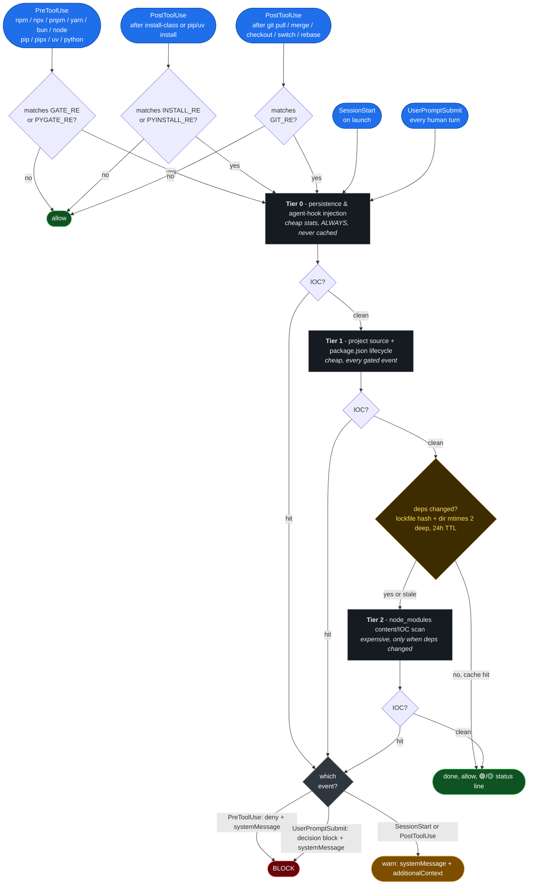

# wormhook

wormhook blocks known npm, Node.js, and landed PyPI supply-chain malware before Claude Code
runs it. It denies `npm`, `pnpm`, `yarn`, `bun`, `npx`, and `node` commands when a local scan
finds an indicator of compromise.

Its focus is agent-boundary persistence: rogue hooks and MCP servers in editor configs,
`folderOpen` tasks, weaponized Python `.pth` files, poisoned git hooks, and persistent
LaunchAgent or systemd units. These mechanisms survive across sessions and sit outside the
registry layer.

Use wormhook with pnpm 11's release-age [cooldown](https://pnpm.io/supply-chain-security),
[Socket Firewall](https://socket.dev/), or [`safedep/vet`](https://github.com/safedep/vet)
for install-time and registry intelligence. The name comes from Shai-Hulud, the
self-replicating npm worm.

Built and maintained by [NoTambourine](https://notambourine.com).

## Install

```bash
claude plugin marketplace add notambourine/claude
claude plugin install wormhook@notambourine --scope user
```

Migrating from `wormhook@wormhook` requires removing the old marketplace first:

```bash
claude plugin uninstall wormhook@wormhook
claude plugin marketplace remove wormhook
claude plugin marketplace add notambourine/claude
claude plugin install wormhook@notambourine --scope user
```

Requires `jq` and `bash`. Content scans prefer
[`ripgrep`](https://github.com/BurntSushi/ripgrep) and fall back to `grep`.

No command is required after installation. At `SessionStart`, a doctor checks runtime deps,
[engine self-integrity](#threat-model-the-scanner-as-a-target), version drift,
signature-corpus age, out-of-band coverage, CI gate coverage,
[companion firewalls](#beyond-the-tiers), and
[credential exposure](#blast-radius-exposure-audit). Healthy checks stay silent. Unhealthy
checks print one repair command.

## Run it outside Claude

`wormhook-scan` exposes the same engine and signature set in any shell.

Run **`/wormhook-setup`** in Claude Code for an interactive install, or install it manually:

```bash
# put wormhook-scan on your PATH (~/.local/bin)
bash "$(jq -r '[.plugins|to_entries[]|select(.key|startswith("wormhook@"))|.value[0].installPath][0] // "."' \
  ~/.claude/plugins/installed_plugins.json 2>/dev/null)/scripts/wormhook-scan.sh" install-cli

wormhook-scan ~/code/*/            # scan every git repo under ~/code (node_modules pruned)
wormhook-scan                      # no args -> roots from your config (see below)
wormhook-scan --deep ~/code/myapp  # force the Tier-2 node_modules walk
wormhook-scan --persistence        # only the machine-wide ($HOME) persistence checks
```

Each path expands to the Git repositories at or below it, with `node_modules` pruned. A
machine-wide finding appears once instead of once per repository. Exit codes are `0` for
clean, `1` for critical or machine persistence, and `2` for degraded coverage.

With no path arguments, `wormhook-scan` reads newline-delimited paths and globs from
`${XDG_CONFIG_HOME:-~/.config}/wormhook/scan-roots` (or `$WORMHOOK_SCAN_ROOTS`).
`wormhook-scan config --init` seeds a commented sample.

Two local, opt-in triggers run without Claude or LLM tokens:

```bash
wormhook-scan install-launchd            # hourly background sweep (macOS launchd)
                                         #   notifies + logs; --every SECONDS to retune
wormhook-scan install-git-hook           # post-merge/checkout/rewrite audit on EVERY
                                         #   `git pull` in ANY terminal (not just Claude)
```

`install-launchd` creates a native macOS LaunchAgent. On Linux, it prints an equivalent
systemd timer or cron entry.

`install-git-hook` preserves an existing `core.hooksPath` and existing hooks. Each pull or
checkout prints **`🟢 wormhook: <repo> clean`** or a finding report before the new code runs.
Changed-file output is capped at 20 entries; the final count remains exact.

`wormhook-scan status` shows what is installed. `uninstall-launchd` and `uninstall-git-hook`
reverse cleanly.

### Optional shell guard

A post-merge hook can only warn after files land. Add this to refuse package-manager commands
in a compromised repository outside Claude:

```bash
eval "$(wormhook-scan shell-init)"   # in ~/.zshrc/.bashrc, AFTER any nvm/asdf
```

The guard wraps `npm`, `pnpm`, `yarn`, `bun`, and `npx`, but not `node`. It fast-scans the
current repository and refuses the command on a hit. It is a tripwire, not a sandbox:
`command npm` and direct `node_modules/.bin` execution bypass it, and a missing
`wormhook-scan` fails open.

When using Socket Firewall, chain both tools in one wrapper. Separate wrappers define the
same function names, so the last one loaded wins. `/wormhook-setup` prints this block:

```bash
eval "$(wormhook-scan shell-init)"   # defines __wormhook_guard
# Helper names are DOUBLE-underscore on purpose: Claude Code's shell snapshot drops
# single-underscore functions (zsh's `_name` completion namespace), which would leave the
# surviving npm/... wrappers calling an undefined helper - bricking npm inside its Bash tool.
__sc_run() {
  local pm="$1"; shift
  command -v __wormhook_guard >/dev/null 2>&1 && { __wormhook_guard || return 1; }
  if command -v sfw >/dev/null 2>&1; then command sfw "$pm" "$@"; else command "$pm" "$@"; fi
}
for pm in npm pnpm yarn bun npx; do eval "${pm}() { __sc_run ${pm} \"\$@\"; }"; done; unset pm
```

### Opt-in quarantine

A Tier-0 finding means the payload may already have run. By default, wormhook reports the
artifact and leaves containment to a human. `WORMHOOK_QUARANTINE=1` instead contains only
exact matches: known persistence paths, a `.pth` with a known-bad name or SHA-256, and
known-bad `.abi3.so` basenames.

```bash
wormhook-scan --quarantine                    # one fleet scan with containment
wormhook-scan install-launchd --quarantine    # the hourly sweep contains at 03:00
# in Claude Code: settings.json -> "env": { "WORMHOOK_QUARANTINE": "1" }
```

Containment renames the artifact to `<path>.wormhook-quarantined.<epoch>` and applies
`chmod 000`. It does not kill processes, unload services, or delete files. Behavioral
matches remain report-only. Root-owned artifacts fall back to the normal advisory. Actions
are logged to
`~/.cache/notambourine/malware-scan/quarantine.log`.

Quarantine is off by default to preserve the fail-open policy.

### Gate pull requests on GitHub (Action)

`action.yml` runs the same engine as a CI check on the checked-out tree:

```yaml
# .github/workflows/supply-chain.yml
name: supply-chain
on: pull_request
permissions:
  contents: read
jobs:
  wormhook:
    runs-on: ubuntu-latest
    steps:
      - uses: actions/checkout@v5
      - run: npm ci                       # optional - installs deps so the deep scan sees them
      - uses: notambourine/wormhook@<sha>  # vX.Y.Z (see "Pinning" below)
        # with:
        #   path: .            # dir to scan (default: workspace root)
        #   mode: deep         # deep = Tier-2 node_modules walk (default); fast = source-only
        #   fail-on: critical  # critical (default) | degraded (fail-closed on 🟡 too)
```

A 🚨 verdict fails the job with exit code `1`. A 🟡 degraded scan passes unless
`fail-on: degraded` is set. The action makes no network calls; it uses `stat`, `grep`, and
`jq` against the checked-out tree.

Pin the commit behind a release tag and keep the tag in a trailing comment. Dependabot can
then track wormhook releases:

```sh
gh release view --repo notambourine/wormhook --json tagName,targetCommitish
```

Do not pin an untagged branch-head SHA. Dependabot cannot resolve its version and may track
every commit on `main`.

This gates merges, not pushes. Pair the action with a ruleset that requires its status check,
requires pull requests, and blocks force pushes. GitHub.com does not expose `pre-receive`
hooks.

## How it works

The scanner spends work where the result can change:

- **Tier 0: persistence and agent injection.** Runs on every event and is never cached. It
  checks RAT droppers, runner installs, rogue MCP servers and hooks across supported editors,
  poisoned git hooks, persistent units, and weaponized Python `.pth` files.
- **Tier 1: project source, lifecycle scripts, and CI config.** Runs on every gated
  event. Install-lifecycle scripts, injected loaders in the source tree, `.github/workflows`
  and `.releaserc` poisoning. This tier blocks an install before it can run a dropper. It
  reads the manifest of the directory the command actually targets (`cd sub && npm install`,
  `npm --prefix`, `yarn --cwd`) and every workspace package's manifest (`workspaces` globs
  plus `pnpm-workspace.yaml`), because a root install runs each workspace's lifecycle.
  Compound and env-prefixed commands (`CI=1 npm install`) gate too.
- **Tier 2: `node_modules` content and IOC scan.** Runs only when dependencies change
  (keyed off lockfile hash plus `node_modules` dir mtimes 2 levels deep, cached under
  `~/.cache/notambourine/`) or when the last clean scan is older than 24 hours
  (`WORMHOOK_T2_TTL_HOURS`). The TTL bounds the cache's inability to detect an in-place
  overwrite. A timeout reports 🟡, leaves the cache stale, and fails open.

### Beyond the tiers

- **Python execution gate.** `pip`, `pip3`, `pipx`, `uv`, `python`, and `python3` trigger
  Tier 0 before execution. This catches a poisoned `.pth` before Python loads it. Coverage
  includes project environments, active virtual or Conda environments, and common user and
  global site-package locations for macOS, Homebrew, `/usr/local`, python.org, pyenv, and uv.
  This is an early persistence check, not a PyPI package audit.
- **Continuous prompt monitor.** Tiers 0 and 1 run on every human turn. A payload written
  mid-session is caught at the next prompt, even if no package-manager or git command runs.
  Clean results stay silent; findings block.
- **Companion firewall check.** Blocking malicious or too-new package versions needs
  registry intelligence, which
  [Socket Firewall](https://docs.socket.dev/docs/socket-firewall) (`sfw`) and
  [`safedep/vet`](https://github.com/safedep/vet) provide. wormhook stays local. Its
  `SessionStart` check recommends those tools until both are present.

### Blast-radius exposure audit

The `SessionStart` exposure audit reports long-lived credentials that would increase the
impact of a missed detection. It checks:

- **SSH private keys without passphrases**, detected with `ssh-keygen -y -P ''` rather than
  an unreliable text search. The report names each file.
- **Plaintext GitHub tokens:** a `ghp_` PAT or `gho_` OAuth token
  in `~/.git-credentials`, the `gh` config, or `GH_TOKEN`/`GITHUB_TOKEN`.
- **Repository `.env` files with credential-shaped values,** such as AWS
  `AKIA...`, GitHub/OpenAI/Google keys, or a PEM block, rather than any `KEY=` line.

The audit is advisory because weak credential posture is not an IOC. It stays limited to
these low-noise checks. Use expiring tokens, hardware-held SSH keys, sandboxed credential
contexts, and secret-manager injection for broader protection.


```mermaid
flowchart TD
    A([SessionStart<br/>on launch]):::evt
    B([PreToolUse<br/>npm / npx / pnpm / yarn / bun / node<br/>pip / pipx / uv / python]):::evt
    C([PostToolUse<br/>after install-class or pip/uv install]):::evt
    D([PostToolUse<br/>after git pull / merge / checkout / switch / rebase]):::evt
    E([UserPromptSubmit<br/>every human turn]):::evt

    B --> Bg{matches GATE_RE<br/>or PYGATE_RE?}
    Bg -- no --> ALLOW
    Bg -- yes --> T0
    C --> Cg{matches INSTALL_RE<br/>or PYINSTALL_RE?}
    Cg -- no --> ALLOW
    Cg -- yes --> T0
    D --> Dg{matches<br/>GIT_RE?}
    Dg -- no --> ALLOW
    Dg -- yes --> T0
    A --> T0
    E --> T0

    T0["<b>Tier 0</b> - persistence &amp; agent-hook injection<br/><i>cheap stats, ALWAYS, never cached</i>"]:::tier
    T0 --> T0c{IOC?}
    T0c -- hit --> G
    T0c -- clean --> T1

    T1["<b>Tier 1</b> - project source + package.json lifecycle<br/><i>cheap, every gated event</i>"]:::tier
    T1 --> T1c{IOC?}
    T1c -- hit --> G
    T1c -- clean --> CACHE

    CACHE{deps changed?<br/>lockfile hash + dir mtimes 2 deep, 24h TTL}:::cache
    CACHE -->|no, cache hit| DONE
    CACHE -->|yes or stale| T2

    T2["<b>Tier 2</b> - node_modules content/IOC scan<br/><i>expensive, only when deps changed</i>"]:::tier
    T2 --> T2c{IOC?}
    T2c -- hit --> G
    T2c -- clean --> DONE

    G{which<br/>event?}:::guard
    G -->|PreToolUse: deny + systemMessage| BLOCK([BLOCK]):::block
    G -->|UserPromptSubmit: decision block + systemMessage| BLOCK
    G -->|SessionStart or PostToolUse| SURFACE([warn: systemMessage + additionalContext]):::warn

    ALLOW([allow]):::ok
    DONE([done, allow, 🟢/🟡 status line]):::ok

    classDef evt fill:#1f6feb,stroke:#0d419d,color:#fff
    classDef tier fill:#161b22,stroke:#30363d,color:#e6edf3
    classDef cache fill:#3d2c00,stroke:#9e6a03,color:#ffdf5d
    classDef guard fill:#30363d,stroke:#6e7681,color:#fff
    classDef block fill:#67060c,stroke:#f85149,color:#fff
    classDef warn fill:#7d4e00,stroke:#d29922,color:#fff
    classDef ok fill:#0f5323,stroke:#3fb950,color:#fff
```

| Event | When | What |
|-------|------|------|
| `PreToolUse` | before an `npm`/`node`/... command | Tier 0-1, plus Tier 2 when dependencies drift; **blocks** on a hit (`permissionDecision: "deny"`) |
| `PreToolUse` | before a `pip`/`uv`/`python` command | Tier 0-1; **blocks** on a hit before Python can load a poisoned `.pth` |
| `PostToolUse` | after an install-class or `pip`/`uv` install command | re-scan of the freshly written tree (Python installs re-run the Tier-0 `.pth` check); warns on a hit |
| `PostToolUse` | after a working-tree-rewriting `git` op (`pull`/`merge`/`checkout`/`switch`/`rebase`) | Tier 0-1 on the new tree (plus Tier 2 on dep drift); warns on a hit. Catches IOCs that arrive over git with no npm involved |
| `UserPromptSubmit` | every human turn | Tier 0-1 ([continuous monitor](#beyond-the-tiers)); **blocks** on a hit (`decision: "block"`). Silent when clean |
| `SessionStart` | on launch | Tier 0-1 (plus Tier 2 on a stale cache); warns on a hit |

These are the Claude-session triggers. [`wormhook-scan`](#run-it-outside-claude) exposes the
same tiers outside Claude.

`PreToolUse` and `UserPromptSubmit` enforce hard blocks. `SessionStart` and `PostToolUse`
cannot undo completed work, so they warn the user and tell the model to refuse follow-up
installs.

Every triggered scan returns one verdict: 🟢 clean, 🟡 degraded coverage, or 🚨 findings.
Degraded scans do not refresh the cache. Commands outside the gate stay silent.

## What it detects

- **Shai-Hulud 1.0-3.0 and the Mini variant.** Obfuscation markers, runner fingerprints,
  ransom tokens, `git-tanstack` typosquat exfil, payload filenames, SHA256 IOCs. The v1
  `shai-hulud-workflow.yml` dropper matches by basename, since Checkmarx published the name
  but not the body. Its `webhook.site` exfil ID lands as a content fingerprint; the bare
  domain would not, it FPs on real test fixtures.
- **SAP-CAP / AntV / TeamPCP wave** (Apr-Jun 2026). The `ctf-scramble-v2` PBKDF2 salt, the
  `firedalazer` and `OhNoWhatsGoingOnWithGitHub` GitHub-commit-search C2 keywords, the
  `__DAEMONIZED` guard, the russian-locale kill-switch, the C2 host `audit.checkmarx.cx`, and
  the `kitty-monitor` LaunchAgent/systemd unit plus its `~/.local/share/kitty/cat.py` daemon.
- **Axios / plain-crypto-js RAT** (Sapphire Sleet / DPRK). `com.apple.act.mond` persistence,
  `sfrclak` C2 beacons.
- **SANDWORM_MODE**, AI-toolchain poisoning. The marker, `*.workers.dev/{exfil,drain}` C2,
  `freefan`/`fanfree` DNS-tunnel domains, the drain bearer token.
- **node-ipc credential stealer** (May 2026). Three releases carried the same 80 KB
  obfuscated IIFE appended to `node-ipc.cjs`, firing on every `require()` with no lifecycle
  hook to gate. Caught by the payload's custom base-16 alphabet (`0123456789GHJKMP`), its
  hardcoded HMAC key, and its `sh.azurestaticprovider.net` DNS-tunnel C2, plus `node-ipc.cjs`
  by name and hash, the filename is the real package's own entry point. The three affected
  version numbers are deliberately not encoded here; version-pinned blocking is
  [Socket Firewall's and `vet`'s job](#scope-boundaries).
- **Hades / Miasma PyPI wave** (Jun 2026). MCP typosquats (`openai-mcp`, `tiktoken-mcp`, ...)
  shipping a weaponized Python `.pth` startup hook (to Bun, to `_index.js`, the Hades
  stealer) and native import-time `.abi3.so` modules (`ensmallen_haswell`/`core2`) that
  execute on package import with no `.pth`, plus `/tmp/.sshu-setup.js` SSH propagation.
  Caught at Tier 0, and `pip`/`uv`/`python` now
  [trigger that scan at `PreToolUse`](#beyond-the-tiers) so it runs before the interpreter
  auto-executes a poisoned `.pth`, not just on the next npm/git command.
- **ChainDrop / keyv-cacheable wave** (Aug 2026). The `setup.mjs` loader and `math_init.js`
  payload by SHA256 hash, plus the Ethereum C2-resolution contract address embedded in the
  payload (`0xE1f2...3103`; the C2 domains resolve at runtime, so the contract, not a domain,
  is the durable handle). The four domains that contract has served, `npm-cache.com`,
  `awqhnjewqjkl.icu`, `pypi-get.com`, `js-mirror.com`, land as a Tier-2 backstop for a build
  that hardcodes one. The wave's GitHub commit-search fallback markers
  (`thebeautiful{march,snads}oftime`) were already covered. Its Dune-themed payload strings
  are not covered and never will be: Unit 42 recovered them by decoding a Base91 table with
  73 per-call alphabets, so no plaintext word reaches disk for a grep to find.
- **"A9-0522" build** (Aug 2026, field-observed). A ChainDrop-lineage payload appended to a
  repo's own `tailwind.config.js` behind roughly 500 spaces of padding, resolving its C2 from
  wallet `0xa322e5f3...` over public Ethereum RPC. Blocks on the dot-form campaign tag
  (`global.i="A9-0522-4"`; the Shai-Hulud 1.0 signature only matched the bracket form) and
  the `:443/0x/{cl,ls}` endpoints. `obfuscator.io` `splitStrings` chops every host into
  10-char chunks, so a reassembled domain matches nothing on disk; the unsplit tag, wallet
  prefix, path, and `X-Payload-B6*` header are the handles. The `obfuscator.io` string-array
  accessor alias lands with it as a campaign-agnostic technique marker. The padding itself
  stays unmatched: `eslint-plugin-import` ships Babel output with 912-space runs.
- **Miasma RAT / AsyncAPI compromise** (`miasma-train-p1`, Jul 2026). An import-time loader
  that runs on `require()` and defeats `--ignore-scripts`. Tier-0 checks for `NodeJS/sync.js`,
  the `~/.config/.miasma` lock dir, and the `miasma-monitor` login unit, plus Tier-2 payload
  markers (`M-RED-TEAM v6.4`, `_miasma._tcp`) and the two IPFS second-stage CIDs.
- **Dev-env and CI injection.** Rogue `mcpServers` and SessionStart-hook entries across
  `.claude`/`.cursor`/`.continue`/`.vscode`, including a `.vscode/tasks.json` `folderOpen`
  task that re-runs `setup.mjs` on every project open. Poisoned git hooks
  (`init.templateDir`/`core.hooksPath`), `pull_request_target` workflows calling the
  `ci-quality/code-quality-check` action, `@semantic-release/exec` carrier injection.
- **Prompt injection hidden in agent configs** (TrapDoor, May 2026). `trap-core.js` plants a
  `CLAUDE.md` or `.cursorrules` whose instructions are built from zero-width Unicode. Your
  agent tokenizes every codepoint; your editor renders none of them, so a poisoned config
  needs to execute nothing, only to be read. wormhook scans `CLAUDE.md`, `.claude/CLAUDE.md`,
  `AGENTS.md`, and `.cursorrules` for U+200B/200C/200D/2060/FEFF on a path that does not
  assume JSON, since the `jq` config scan structurally cannot read markdown. Only U+200B
  matches on its own; every other codepoint needs a printable ASCII neighbor, which exempts
  emoji ZWJ, a leading byte-order mark, and the U+200C that Persian/Urdu/Hindi prose spells
  words with, that is what keeps this block-safe. Prose configs are checked for hidden
  codepoints only, never dropper tokens: a `CLAUDE.md` documenting `curl ... | sh` is a
  README, while a `settings.json` running one is wiring.
- **Remote-eval loaders.** `atob(process.env....)` plus `eval`/`Function(await ...)`
  behavioral fingerprints, plus field-observed C2 and exfil hosts.
- **Campaign-agnostic behaviors** (`node_modules` tier only). Decode-then-`eval` droppers,
  `/dev/tcp/` reverse shells, `JSON.stringify(process.env)` bulk exfil. Higher-FP, so scoped
  to third-party deps.

The threat path this is organized around: a contributor or compromised maintainer's PR
slipping malware into a repo you already work in. Where `pull_request_target` and
`@semantic-release/exec` are legitimately common, the scans key off campaign-specific
fingerprints (the known-bad action slug, the carrier `require()`) so CI false positives stay
at zero.

## Scope boundaries

These checks need network or runtime context that a synchronous local hook does not have.
Use the owning layer alongside wormhook.

| Check it doesn't do | Layer that owns it |
|---------------------|--------------------|
| Package existence / typosquatting / maintainer-change (needs registry lookups) | [Socket Firewall](https://docs.socket.dev/docs/socket-firewall), [`safedep/vet`](https://github.com/safedep/vet) |
| Version-age "cooldown" (refuse versions published in the last N days) | native now: pnpm [`minimumReleaseAge`](https://pnpm.io/supply-chain-security) (default-on in pnpm 11), npm `min-release-age`; also Socket Firewall |
| Known-CVE scanning (needs an advisory feed) | `vet`, `npm audit`, Dependabot |
| Secret detection | [`betterleaks`](https://github.com/betterleaks/betterleaks), `trufflehog` (this repo runs betterleaks over full history in CI) |
| Generic Actions hardening (unpinned actions, broad perms) | `actionlint`, `zizmor` |
| Runtime network monitoring (live C2/DNS exfil/sockets) | install-time sandbox / eBPF monitor |
| AST + reachability analysis | [depsec](https://depsec.dev/) |
| Flagging any `child_process` exec/spawn (block-tier FP catastrophe) | [GuardDog](https://github.com/DataDog/guarddog) (triage) |
| Credential-read to exfil (needs taint tracking) | GuardDog (`mode: taint`) |
| Auditing PyPI package contents (wormhook gates `pip`/`uv`/`python` execution only, to run the Tier-0 `.pth` check early) | install-time sandbox / `vet` / GuardDog |

wormhook favors an independent, fast, low-noise agent-boundary gate over broad but ambiguous
coverage.

## Threat model: the scanner as a target

The engine and signatures live under `$HOME`. Any process that can write
`~/.claude/setup.mjs` may also be able to modify the scanner.

- **Covered:** payloads written beside the scanner. Tier 0 checks attacker-writable agent
  paths on every event without a cache.
- **Residual gap:** direct plugin tampering. An attacker could disable the engine or empty
  the signature set. `.tripwire-allow` excludes the engine and corpus from content scanning
  because an IOC corpus necessarily resembles malware.

At every launch, the `integrity` check compares `scripts/wormhook.sh` and
`scripts/malware-patterns.sh` with `scripts/integrity.sha256`. A mismatch is an unsilenceable
🔴 alert. An attacker who can also replace the manifest can bypass it, but a one-line engine
edit no longer looks healthy. CI rejects stale manifests. Because the plugin directory is a
Git checkout, `git -C <plugin-dir> status` reveals local changes and a marketplace update
restores the published copy.

## Signatures

[`scripts/malware-patterns.sh`](./scripts/malware-patterns.sh) is the single signature
source for every tier. Its extended regular expressions parse identically in Bash and Zsh.

`WORMHOOK_SIGNATURES_ASOF` records the last advisory review. The `SessionStart` `sigage`
check turns 🟡 after `WORMHOOK_SIGAGE_MAX_DAYS`, which defaults to 60.

## Sources

IOCs trace to primary vendor and government advisories. Per-marker provenance is mirrored in
the header of [`scripts/wormhook.sh`](./scripts/wormhook.sh).

- **CISA** - [npm ecosystem supply-chain compromise](https://www.cisa.gov/news-events/alerts/2025/09/23/widespread-supply-chain-compromise-impacting-npm-ecosystem) (Shai-Hulud 1.0)
- **Microsoft** - [Shai-Hulud 2.0 guidance](https://www.microsoft.com/en-us/security/blog/2025/12/09/shai-hulud-2-0-guidance-for-detecting-investigating-and-defending-against-the-supply-chain-attack/)
- **Datadog** - [Shai-Hulud 2.0 npm worm](https://securitylabs.datadoghq.com/articles/shai-hulud-2.0-npm-worm/)
- **Wiz** - [Mini Shai-Hulud: TanStack & more](https://www.wiz.io/blog/mini-shai-hulud-strikes-again-tanstack-more-npm-packages-compromised)
- **Semgrep** - [Axios supply-chain incident](https://semgrep.dev/blog/2026/axios-supply-chain-incident-indicators-of-compromise-and-how-to-contain-the-threat/)
- **Socket** - [SANDWORM_MODE](https://socket.dev/blog/sandworm-mode-npm-worm-ai-toolchain-poisoning), [Miasma & Hades (PyPI/MCP)](https://socket.dev/blog/mini-shai-hulud-miasma-and-hades-worms-target-bioinformatics-and-mcp-developers-via-malicious)
- **Phoenix Security** - [TrapDoor: cross-ecosystem credential theft and AI-assistant poisoning](https://phoenix.security/trapdoor-supply-chain-ai-poisoning-npm-pypi-crates/) (zero-width Unicode in `CLAUDE.md` / `.cursorrules`)
- **Checkmarx** - [npm hit by Shai-Hulud](https://checkmarx.com/zero-post/npm-hit-by-shai-hulud-the-self-replicating-supply-chain-attack/) (`shai-hulud-workflow.yml`, the `webhook.site` exfil ID)
- **StepSecurity** - [Malicious node-ipc versions published to npm](https://www.stepsecurity.io/blog/node-ipc-npm-supply-chain-attack) (base-16 alphabet, HMAC key, `node-ipc.cjs` hash, `sh.azurestaticprovider.net`)
- **Snyk** - [Mini Shai-Hulud hits AntV](https://snyk.io/blog/mini-shai-hulud-antv-npm-supply-chain-attack/) (`kitty-monitor`, `firedalazer`, `.vscode/tasks.json` `folderOpen`)
- **Unit 42** - [Monitoring npm supply-chain attacks](https://unit42.paloaltonetworks.com/monitoring-npm-supply-chain-attacks/) (`audit.checkmarx.cx`, `OhNoWhatsGoingOnWithGitHub` C2), [Inside a self-propagating npm worm](https://unit42.paloaltonetworks.com/chaindrop-npm-worm-analysis/) (ChainDrop C2 domains, Base91 layering)
- **Mend** - [Shai-Hulud SAP CAP via Claude Code](https://www.mend.io/blog/shai-hulud-sap-cap-supply-chain-attack-claude-code/) (`ctf-scramble-v2`, `__DAEMONIZED`, russian-locale kill-switch)
- **Microsoft** - [AsyncAPI compromise & Miasma import-time payload](https://www.microsoft.com/en-us/security/blog/2026/07/15/unpacking-asyncapi-npm-supply-chain-compromise-import-time-payload-delivery/) (`miasma-train-p1`, `NodeJS/sync.js`, `.miasma`, IPFS CIDs), [ChainDrop anatomy](https://www.microsoft.com/en-us/security/blog/2026/08/04/chaindrop-supply-chain-compromise-anatomy-self-propagating-worm/)
- **Elastic** - [ChainDrop / keyv Shai-Hulud wave](https://www.elastic.co/security-labs/shai-hulud-chaindrop-npm-supply-chain) (payload hashes, ETH contract)
- **JFrog** - [Shai-Hulud is back (Aug 2026)](https://research.jfrog.com/post/shai-hulud-is-back-august/) (`math_init.js` hash pairing, runtime C2 resolution)
- **Field-observed, no advisory** - the "A9-0522" build. Its markers sit a provenance tier
  below every entry above (same class as `api.masscan.cloud` and `m-kosche.com`): they come
  from a sample recovered off a compromised account, not a named vendor page, so only the two
  zero-FP-verified markers reach the blocking tier and the rest stay warn-only.

## License

MIT. See [LICENSE](./LICENSE).
